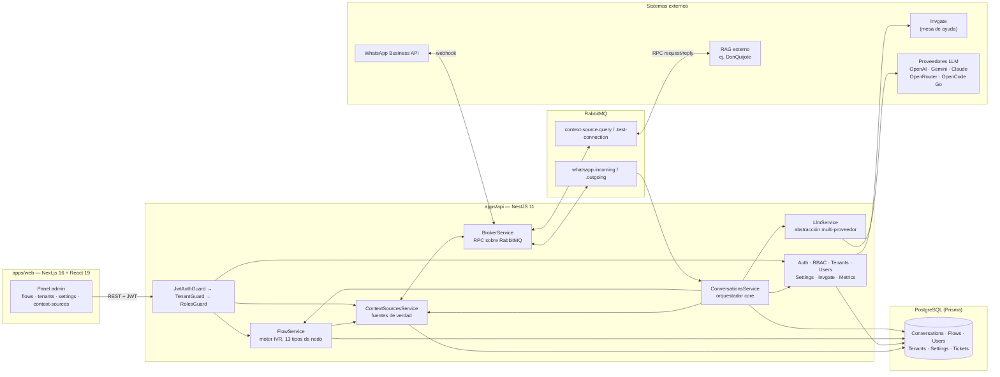

# Arquitectura del proyecto

Diagrama de alto nivel del monorepo `pci-chatbot`: frontend, backend NestJS, broker de mensajería y sistemas externos. Ver `AGENTS.md` para las convenciones y constraints que explican por qué está armado así (desacople de canales vía broker, secrets cifrados, RBAC dinámico, etc.) y `docs/plan-de-trabajo.md` para el estado de cada pieza.

## Capas

- **apps/web** — panel de administración (Next.js). Habla con el backend por REST, siempre con JWT y el header de tenant activo.
- **Guards** — cadena `JwtAuthGuard → TenantGuard → RolesGuard`: autenticación, aislamiento por tenant (`@CurrentTenant`) y permisos (`@RequirePermission`) antes de llegar a cualquier controller.
- **ConversationsService** — orquestador core: recibe mensajes desde `whatsapp.incoming`, corre el flujo activo (`FlowService`) y, cuando el flujo se sale de guion, delega en el LLM (con la fuente de verdad vinculada al flujo, si tiene una).
- **FlowService** — motor IVR: 13 tipos de nodo (`start`, `menu`, `input`, `ticket_create`, `llm_query`, `transfer_agent`, etc.), editor visual en el panel con ReactFlow.
- **LlmService** — abstracción provider-agnostic sobre 5 proveedores de LLM, configurables desde `/settings` (cascada BD → env → default).
- **ContextSourcesService** — "fuentes de verdad" vinculables a un flujo: MCP, RAG por HTTP, webhook n8n, o un RAG propio conectado por broker (RPC con modo `rpc` o `fixedQueue`).
- **BrokerService** — el único punto de I/O externo asíncrono (RabbitMQ): mensajería de WhatsApp entrante/saliente y las consultas a fuentes de verdad por broker pasan todas por acá — es la pieza que garantiza el "desacople de canales" (`AGENTS.md`).
- **PostgreSQL / Prisma** — persistencia principal: conversaciones, flujos, usuarios, tenants, settings, tickets.
- **Externos** — WhatsApp Business API (webhook), Invgate (mesa de ayuda, vía usuario técnico dedicado, nunca credenciales del usuario final), proveedores de LLM, y RAGs externos como DonQuijote.
